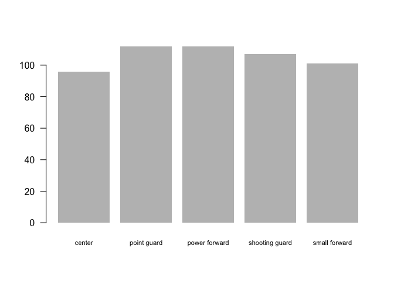
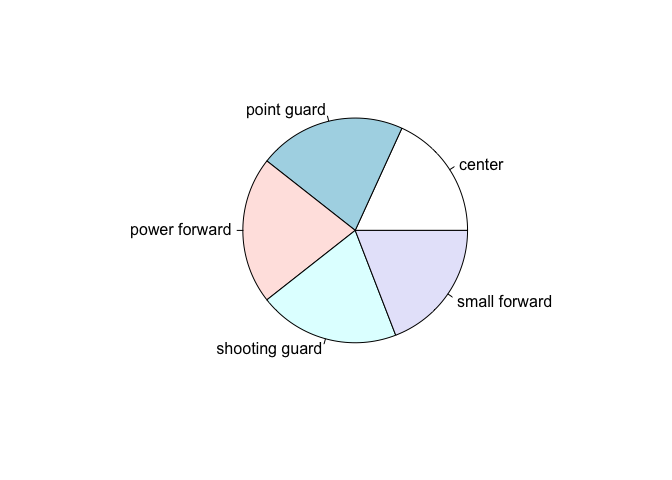
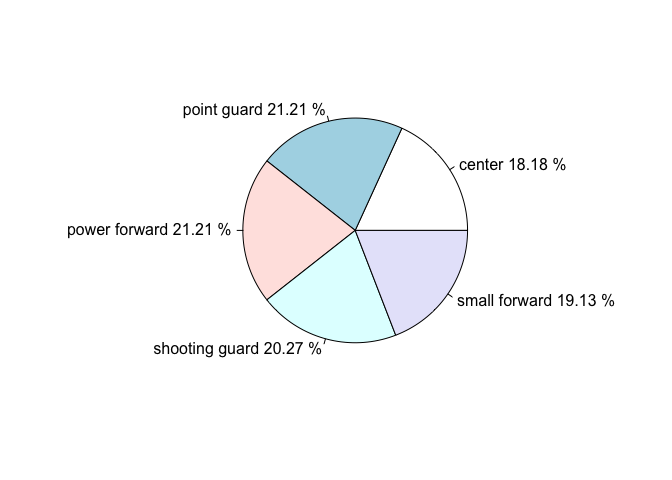
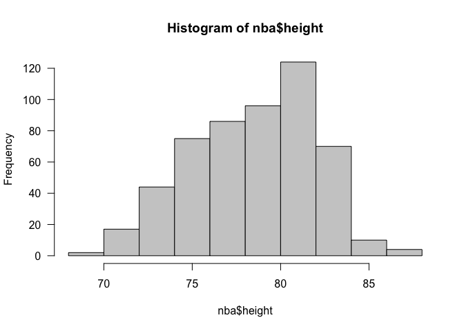
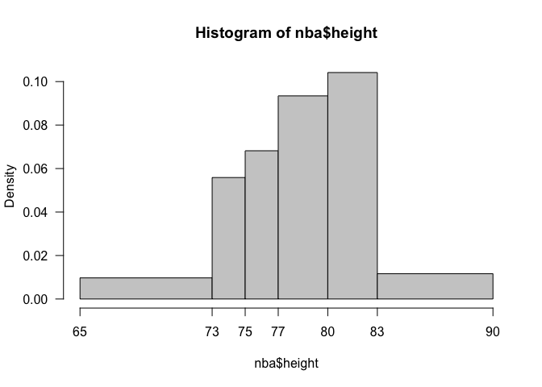
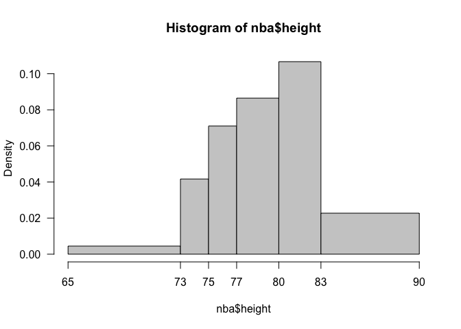
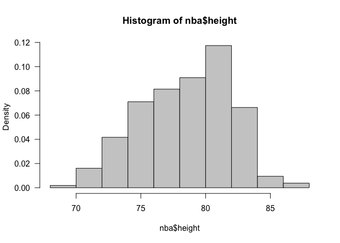
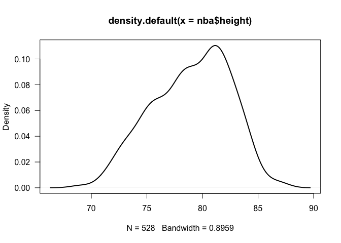

Histograms
================
Gaston Sanchez

> ### Learning Objectives
> 
>   - Visualizing quantitative variables
>   - Get to know the function `hist()`

## Intro to Descriptive Statistics

The first part of the course has to do with **Descriptive Statistics**.
The main idea is to make a “large” or “complicated” dataset more compact
and easier to understand by using three major tools:

  - summary and frequency tables
  - charts and graphics
  - key numeric summaries

Describing and summarizing data can be done in many different ways. An
important consideration involves distinguishing variables between
quantitative and qualitative ones. Depending on the type of variable,
you will use certain types of visual displays and calculate specific
types of numeric values. Keep in mind that not all graphics are valid
for all classes of variables. And not all arithmetic operations will
make sense on all types of variables.

## More NBA Data

We are going to consider data of basketball players from the NBA. The
data is from the season 2015-2016 and it is available in the file
`nba_players.csv` (see the folder `data` in the course’s github
repository).

### Reading CSV Tables

The first step involves importing the data in R. Because the data is
already in a tabular format (stored in a CSV file), you can use the
function `read.csv()`. What you need is to pass the URL address of the
file:

``` r
# assembling the URL of the CSV file
# (otherwise it won't fit within the margins of this document)
repo = 'https://raw.githubusercontent.com/ucb-introstat/introstat-fall-2018/'
datafile = 'master/data/nba_players.csv'
url = paste0(repo, datafile)

# read in data set
nba = read.csv(url)
```

If you get an error message, make sure that you have the right URL
address, check the correct use of single or double quotes, and verify
the names of the functions.

*Technical Note:* by default, `read.csv()` automatically converts any
columns containing character strings as R factors.

The object `nba` is a data frame. Usually, after you import a data frame
in R, you may want to use a handful of functions to inspect its
properties and basic structure:

  - `str(nba)`: display overall structure of the table
  - `dim(nba)`: dimensions (i.e. size) of the table
  - `head(nba, n = 5)`: show first `n` rows
  - `tail(nba, n = 5)`: show last `n` rows
  - `names(nba)`: column names
  - `colnames(nba)`: sames as `names(nba)`
  - `summary(nba)`: descriptive summary of variables in `nba`

<!-- end list -->

``` r
# dimensions (num rows and columns)
dim(nba)
```

    ## [1] 528  39

``` r
# names of first 10 columns
names(nba[ ,1:10])
```

    ##  [1] "player"            "player_num"        "position"         
    ##  [4] "height"            "weight"            "birthdate"        
    ##  [7] "country"           "experience"        "college"          
    ## [10] "team_stat_ranking"

``` r
# basic summary of first 3 columns
summary(nba[ ,1:3])
```

    ##               player      player_num              position  
    ##  James Ennis     :  3   Min.   : 0.00   center        : 96  
    ##  Kris Humphries  :  3   1st Qu.: 6.00   point guard   :112  
    ##  Alex Stepheson  :  2   Median :13.00   power forward :112  
    ##  Anderson Varejao:  2   Mean   :17.55   shooting guard:107  
    ##  Andre Miller    :  2   3rd Qu.:25.00   small forward :101  
    ##  Beno Udrih      :  2   Max.   :99.00                       
    ##  (Other)         :514

## Frequency tables

As we mention before, an important consideration has to do with
identifying the type of variables: quantitative -vs- qualitative.

An example of a qualitative variable is `position`. This variable
contains the position of each player. When you inspect a qualitative
variable, you typically start by computing a **frequency table**. A
frequency table shows the frequencies or counts of each category. In R,
we have the function `table()` to obtain this type of table.

To obtain the frequencies of the positions simply type:

``` r
freq_position = table(nba$position)
freq_position
```

    ## 
    ##         center    point guard  power forward shooting guard  small forward 
    ##             96            112            112            107            101

Often, it is convenient to express the frequencies as proportions or
percentages, also referred to as **relative frequencies**.

``` r
prop_position = freq_position / sum(freq_position)
prop_position
```

    ## 
    ##         center    point guard  power forward shooting guard  small forward 
    ##      0.1818182      0.2121212      0.2121212      0.2026515      0.1912879

If you want to express the proportions as percentages, multiply
`prop_position` times 100:

``` r
perc_position = 100 * prop_position
perc_position
```

    ## 
    ##         center    point guard  power forward shooting guard  small forward 
    ##       18.18182       21.21212       21.21212       20.26515       19.12879

## Bar-Charts and Pie-Charts

Having obtained the frequencies and/or proportions of the categories of
a qualitative variable, we can proceed our exploration with some visual
displays. There are two most common graphics that are used to visualize
frequencies:

  - bar-charts
  - pie-charts

To create a bar-chart in R you can use the `barplot()` function. This
function requires a numeric vector or a table of
frequencies:

``` r
barplot(freq_position, las = 1, border = NA, cex.names = 0.7)
```


The use of `barplot()` includes the arguments `las`, `border`, and
`cex.names`:

  - `las = 1`: displays the frequencies perpendicular to the y-axis
  - `border = NA`: removes the black border around bars
  - `cex.names = 0.7`: reduces the sizes of the category labels (so they
    all fit in the plot)

**Pie Chart**. The other common type of chart to see frequencies is a
pie-chart. R provides the function `pie()` to produce these
charts:

``` r
pie(freq_position)
```



If you want to display the frequencies, you can do something like this:

``` r
pie(freq_position, 
    labels = paste(levels(nba$position), round(perc_position, 2), "%"))
```



### Your Turn

Obtain a frequency table of the variable `team`, and plot a bar-chart of
such frequencies.

-----

## Looking at Quantitative Variables

Most of the variables in the data set `nba` are of quantitative nature.
One possibility to visually inspect those variables is to *categorize*
them and then use a bar-chart or a pie-chart. Another possibility is to
use a couple of displays specifically dedicated to quantitative
variables:

  - histograms
  - box-and-whisker plots (aka boxplots)

### Histograms

A [histogram](https://en.wikipedia.org/wiki/Histogram) is a type of plot
that shows the **distribution** of numerical data. To produce
histograms, R provides the function `hist()`. The default action of
`hist()` is to plot a histogram, but you can also store its output in an
R object. Inspecting such an object will let you see the different
components used to plot the histogram.

Let’s apply `hist()` on the column `height` (in inches) and save its
output in the object
`height_hist`:

``` r
height_hist = hist(nba$height, las = 1, col = 'gray80')
```



As you can tell, a histogram is very similar to a bar-chart. The common
feature is the use of bars and the use of an axis to display some sort
of frequency measure. However, a histogram is NOT a bar-chart. There are
special attributes in a histogram that makes it different from a
bar-chart.

In a histogram, the bars are adjacent (no gaps between bars). Moreover,
the bars cannot be rearranged in a different order. Unlike bar-charts,
what matters in a histogram is not the length of the bars but their
areas. The area of a bar in a histogram should be equal to the
proportion of the bin.

Because we stored the output produced by `hist()` in the object
`height_hist`, we can type this object to see what output is contained
in it:

``` r
height_hist
```

    ## $breaks
    ##  [1] 68 70 72 74 76 78 80 82 84 86 88
    ## 
    ## $counts
    ##  [1]   2  17  44  75  86  96 124  70  10   4
    ## 
    ## $density
    ##  [1] 0.001893939 0.016098485 0.041666667 0.071022727 0.081439394
    ##  [6] 0.090909091 0.117424242 0.066287879 0.009469697 0.003787879
    ## 
    ## $mids
    ##  [1] 69 71 73 75 77 79 81 83 85 87
    ## 
    ## $xname
    ## [1] "nba$height"
    ## 
    ## $equidist
    ## [1] TRUE
    ## 
    ## attr(,"class")
    ## [1] "histogram"

  - `breaks`: breaking (cutting) points of class intervals
  - `counts`: number of observations in each bin
  - `density`: density
  - `mids`: mid-point of class intervals
  - `xname`: name of object (variable) that is plotted
  - `equidist`: are bins of equal width?
  - `attr`: class attribute (an object of class histogram)

`hist()` produces a histogram using predefined settings. By default, it
will determine the number of bins or class intervals automatically. Like
most histograms produced by statistical software, the default bins are
of equal size. Also, the class-intervals are right-closed (i.e. the
right endpoint is included). In the example above this means that the
bins are:

  - (68-70\]
  - (70-72\]
  - (72-74\]
  - (74-76\]
  - (76-78\]
  - (78-80\]
  - (80-82\]
  - (82-84\]
  - (84-86\]
  - (86-88\]

### Steps to plot a histogram

To make a histogram, the first step is to “bin” the range of values—that
is, divide the entire range of values into a series of class
intervals—and then count how many values fall into each
class-interval. The resulting number of counts in a bin will give be
associated to a bar in a histogram.

### Unconventional Histograms

I want to highlight the difference of some of the histograms displayed
in the textbook (SticiGui) with the histograms that you usually obtain
with virtually all software programs. SticiGui is one of the very few
introductory statistics book that shows histograms with bins of unequal
sizes. In real life, you won’t probably see many histograms like these.
In fact, I don’t remember seeing a histogram of unequal bin-widths
published in a scientific journal.

Interestingly, though, you can use `hist()` to produce histograms with
bins of unequal width. To do so, you must use the `breaks` argument to
provide a vector of intervals. Let’s see how to produce a histogram with
the following class-intervals:

  - (65-73\]
  - (73-75\]
  - (75-77\]
  - (77-80\]
  - (80-83\]
  - (83-90\]

<!-- end list -->

``` r
# right-closed interval with unequal bins
height_hist2 = hist(
  x = nba$height,
  breaks = c(65, 73, 75, 77, 80, 83, 90),  # vector of class intervals
  col = 'gray80', 
  las = 1,
  axes = FALSE)
# x-axis with tick-marks that match the bins
axis(side = 1, at = c(65, 73, 75, 77, 80, 83, 90))
# y-axis
axis(side = 2, las = 1)
```



Note that we are turning off the display of the axes when using
`hist()`. In order to “manually” plot the axes, we call the function
`axis()`. The y-axis is plotted with the argument `side = 2`. In turn,
the x-axis is plotted with the argument `side = 1`, indicating the
position of the tick marks `at = c(65, 73, 75, 77, 80, 83, 90)`.

Notice also that when the bins are of unequal size, `hist()` produces
what the FPP book refers to as a histogram with a **density scale**.
This means that the vertical axis does not show the frequency or count
anymore. Instead, the height of the bars are expressed in a scale such
that the area of the bars represent percentages.

``` r
# bin widths
widths = height_hist2$breaks[2:7] - height_hist2$breaks[1:6]

# percentages: (bin widths) * (bar heights)
widths * height_hist2$density
```

    ## [1] 0.07765152 0.11174242 0.13636364 0.28030303 0.31250000 0.08143939

``` r
# sum of percentages must equal 1
sum(widths * height_hist2$density)
```

    ## [1] 1

### Histogram with right open (left-closed) intervals

An alternative histogram can be produced if we specify right-open
intervals:

  - \[65-73)
  - \[73-75)
  - \[75-77)
  - \[77-80)
  - \[80-83)
  - \[83-90)

To plot a histogram with the previous bins, you must specify the
argument `right = FALSE`:

``` r
# left-closed bins
left_closed = hist(
  x = nba$height,
  breaks = c(65, 73, 75, 77, 80, 83, 90),
  right = FALSE,
  col = 'gray80', 
  las = 1,
  axes = FALSE)
# x-axis
axis(side = 1, at = c(65, 73, 75, 77, 80, 83, 90))
# y-axis
axis(side = 2, las = 1)
```



### Histogram with a density scale

You can also invoke `hist()` with the default equal bins, but showing a
density scale by specifying the argument `probability =
TRUE`:

``` r
hist(nba$height, probability = TRUE, las = 1, col = 'gray80')
```



## Density Curves

If you take a look at the FPP book, you will see that some histograms
are sketched not with bars but with some sort of continuous curve. These
figures are drawn as idealized or stylized histograms, just for
conceptual purposes.

In practice, you can use statistical software to get similar graphics by
obtaining what is known as a *density curve*. The computational
procedure behind these type of curves involves estimating a [kernel
density](https://en.wikipedia.org/wiki/Kernel_density_estimation).
Estimating kernel densities is out of the scope of the course, but I
will show you how to produce a plot that ressembles the sketched
smoothed histograms of the textbook.

The first step is to use `density()` to obtain the kernel density
estimation (KDE). After obtaining the KDE, you can pass it to `plot()`
to get a smooth density curve:

``` r
height_density = density(nba$height)
plot(height_density, las = 1, lwd = 2)
```



Sometimes it is useful to plot a histogram, and then overlap a density
curve. This is achieved in R with the following code:

``` r
hist(nba$height, probability = TRUE, las = 1, col = 'gray80')
lines(height_density, lwd = 3, col = "tomato")
```


The density curve is added via the `lines()` function. Note that we are
invoking `hist()` using the argument `probability = TRUE` in order to
obtain a density scale in the y-axis.
